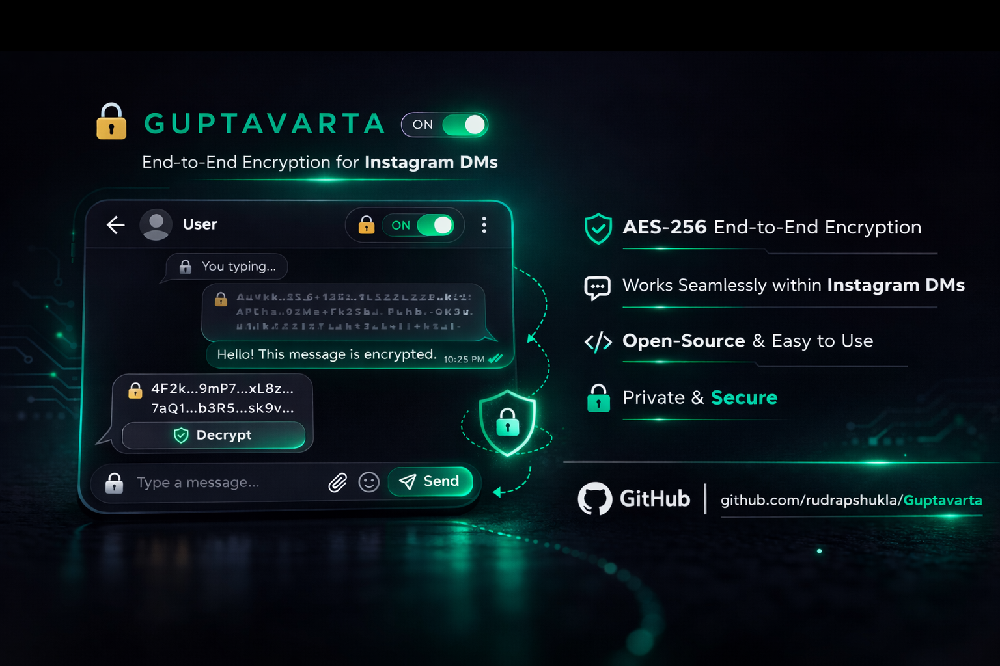
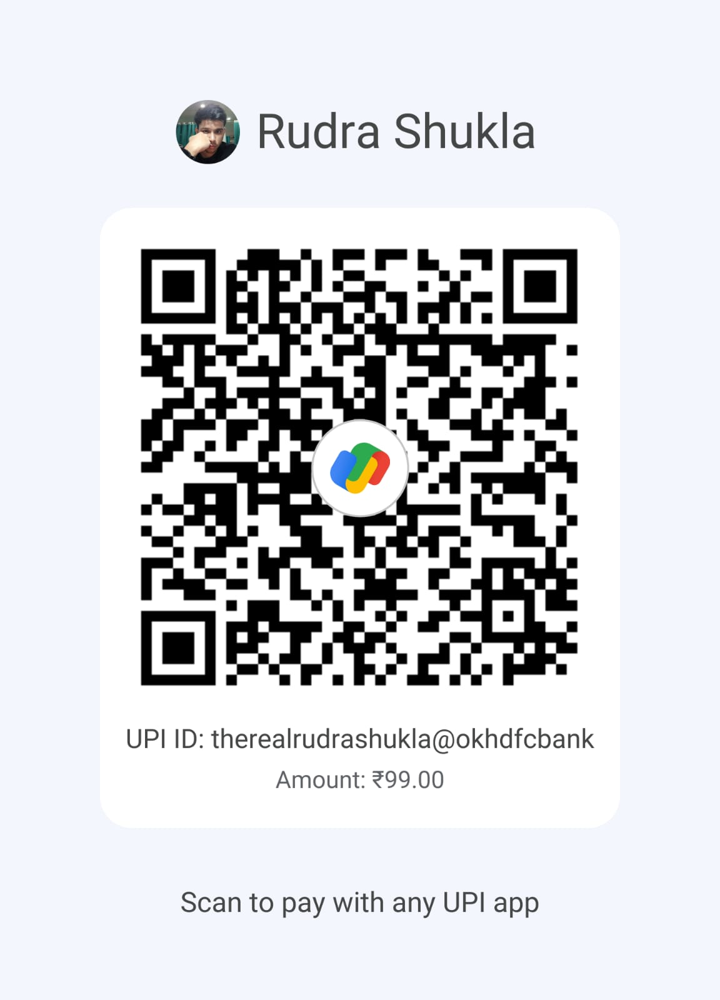

# गुप्तवार्ता · Guptavarta

> *असतो मा सद्गमय*
> *Lead me from falsehood to truth.*
> — Bṛhadāraṇyaka Upaniṣad, 1.3.28

**End-to-end encryption for Instagram DMs.**
Because apparently a trillion-dollar company needed help understanding the word *private*.

---

## What is this

A Chrome extension that encrypts your Instagram DMs using **AES-256-GCM** before they leave your device. Instagram's servers receive a blob of mathematical gibberish. Only someone with Guptavarta installed can decrypt it.

No accounts. No keys to manage. No setup. Just install and type.

Meta removed E2E encryption from Instagram DMs. So I built it back. You're welcome, Zuckerberg.



---

## How it works

```
You type  →  AES-256-GCM encrypts it  →  Instagram sees: GPV:k2jH9mX...
                                                                    ↓
                                          Receiver sees: Decrypt button
                                                                    ↓
                                                        Original message
```

Technically speaking:
- A **PBKDF2** function (100,000 iterations, SHA-256) derives a shared AES-256 key from a passphrase
- A **fresh random 12-byte IV** is generated for every single message - identical plaintext never produces identical ciphertext
- **AES-256-GCM** encrypts the message using that key + IV
- Only activates on `/direct/` pages - comments, posts, reels completely untouched

---

## Install

> Chrome Web Store listing coming — pending a $5 donation to cover the developer fee.
> Until then, load it manually. Takes 30 seconds.

1. Download or clone this repo
2. Go to `chrome://extensions`
3. Enable **Developer Mode** (top right)
4. Click **Load unpacked** → select the `guptavarta` folder
5. Pin it. Open Instagram. Start a DM.

```bash
git clone https://github.com/rudrapshukla/guptavarta.git
```

---

## Usage

| Action | What happens |
|---|---|
| Open an Instagram DM | Extension activates automatically |
| Type a message + Enter | Encrypted before Instagram sees it |
| Receive an encrypted message | See 🔒 *Encrypted message* + Decrypt button |
| Click Decrypt | Message reveals with a fade-in |
| Toggle OFF in popup | Back to normal Instagram, no encryption |

**Both sides need the extension.** That's the only requirement.

---

## Security — honest notes

Guptavarta uses symmetric encryption with a shared key baked into the extension. No lies, no fine print:

✅ Instagram's servers receive and store only encrypted gibberish
✅ Zero metadata stored anywhere by this extension
✅ Fresh IV every message — no ciphertext patterns to analyse
✅ AES-256-GCM — the same standard used by banks and militaries

⚠️ The shared key lives in `content.js` — anyone who installs this extension can decrypt any message sent with it. This is a deliberate design tradeoff for zero-setup usability, not an oversight. This protects you from Meta and mass surveillance - not from a determined adversary with access to your device or this codebase.

⚠️ If your device is compromised, no encryption saves you. That's true of Signal too.

This is a privacy tool, not a spy tool. Know the difference. Use accordingly.

For a threat model requiring per-user private keys — v2 is on the roadmap.

---

## Why *Guptavarta*

**गुप्त** (Gupta) — hidden, secret, protected. Also the name of India's golden age dynasty. Chosen deliberately.

**वार्ता** (Varta) — message, news, communication.

*Secret message.* In Sanskrit. 3000 years old and still the most accurate description of what this does.

---

## Tech stack

| Layer | Technology |
|---|---|
| Encryption | AES-256-GCM |
| Key derivation | PBKDF2 · SHA-256 · 100,000 iterations |
| Crypto engine | Web Crypto API (native browser, zero dependencies) |
| Extension | Chrome Manifest V3 |
| Dependencies | None. Zero. Absolutely none. |

No npm. No webpack. No 400MB `node_modules` folder having an existential crisis.
Just browser-native cryptography that ships inside every Chromium browser already.

---

## File structure

```
guptavarta/
├── manifest.json       # Extension config
├── content.js          # The brain — encryption, injection, DOM scanning
├── content.css         # Styling for injected UI elements
├── popup/
│   ├── popup.html      # Extension popup
│   └── popup.js        # Toggle logic
└── icons/
    ├── icon16.png
    ├── icon48.png
    └── icon128.png
```

---

## Roadmap

- [ ] Firefox support
- [ ] Public/private key architecture (v2 — for when trust is not assumed)
- [ ] Chrome Web Store listing (pending $5 - you know what to do)
- [ ] Per-conversation key override

---

## Contributing

Found a bug? Open an issue.
Have a better idea? Open a PR.
Want to argue about encryption? My email is right there, or dm me on Instagram

This is open source because privacy tools should be auditable. If you can read this code and find a flaw, you're exactly the kind of person who should be contributing.

---

## Author

**Rudra Pratap Shukla**

[GitHub](https://github.com/rudrapshukla) · [Email](mailto:rudrapshukla@proton.me) · [Instagram](https://www.instagram.com/rudrapshukla/)


## Support

Guptavarta is free. Always will be.  
But if it saved your privacy, chai is appreciated. ☕



**UPI:** `therealrudrashukla@okhdfcbank`  
*₹99 — covers the Chrome Web Store listing*


---

## License

MIT — do whatever you want, just don't sell it back to Meta, maybe a small credit, will do the work

---

<div align="center">

*असतो मा सद्गमय*

*Lead me from falsehood to truth.*

</div>
